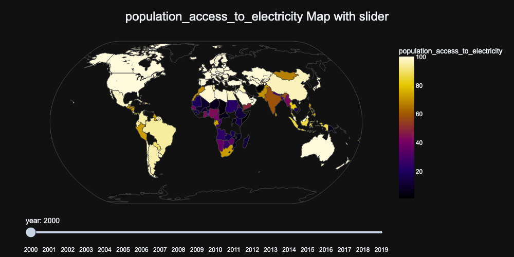
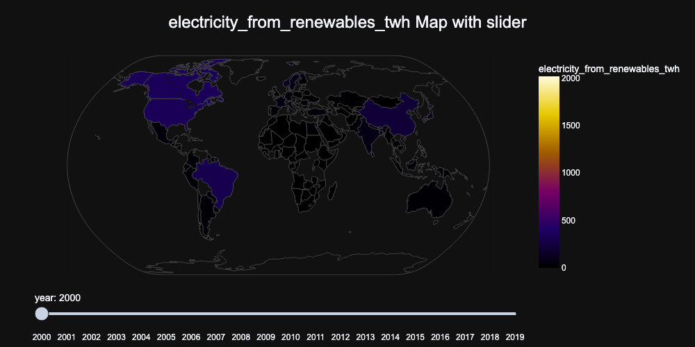
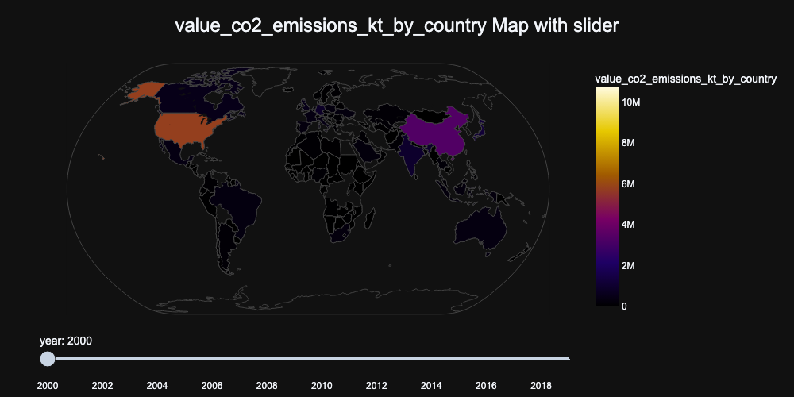

## Basic EDA on a Global Sustainable Energy data
The notebook covers some basic EDA on the `Global Data on Sustainable Energy` dataset from Kaggle

Some of the concepts in the notebook:
- General description
- Features, their types and description
- Some data cleaning
- Identifying features that work well together
- Charting
- Hypotheses
- Next steps (recommendations, use cases)

Conveying information to shareholders is important, EDA is an important step before modeling and for understanding the data you're working with.

Note: It's not perfect and I'm sure there's a few things to fix in this notebook. If you spot any mistakes, incomplete information or have a suggestion that'll help me improve the content of the notebook, I'd be more than happy to receive your feedback!

> Sub-note: Some interactive charts aren't showing so you'll need to run the notebook yourself to see them in action

